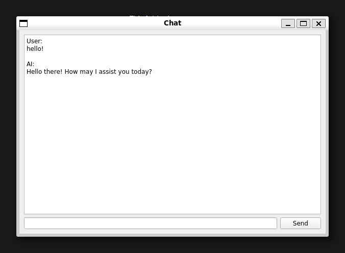

# GPTtoolbox
app with GUI for various models of GPT

## Requirements
```bash
sudo apt-get install qtbase5-dev
pip install -r requirements.txt
```

## API key
1. Get Your [Openai API keys](https://platform.openai.com/account/api-keys)
2. Paste it in config.ini
    ```
    [settings]
    api_key = xxxxxxxxx[YOUR_API_KEY]
    ```

**Important Action: Ensure the safety of your API keys. Never make them publicly accessible or upload them to a public repository.**

## Usage
```
python src/main.py
```
### Available programs
|Name|Filename|Fucntion|
|--|--|--|
|Chat|src/stream_chat.py| Text conversation|

### Chat

