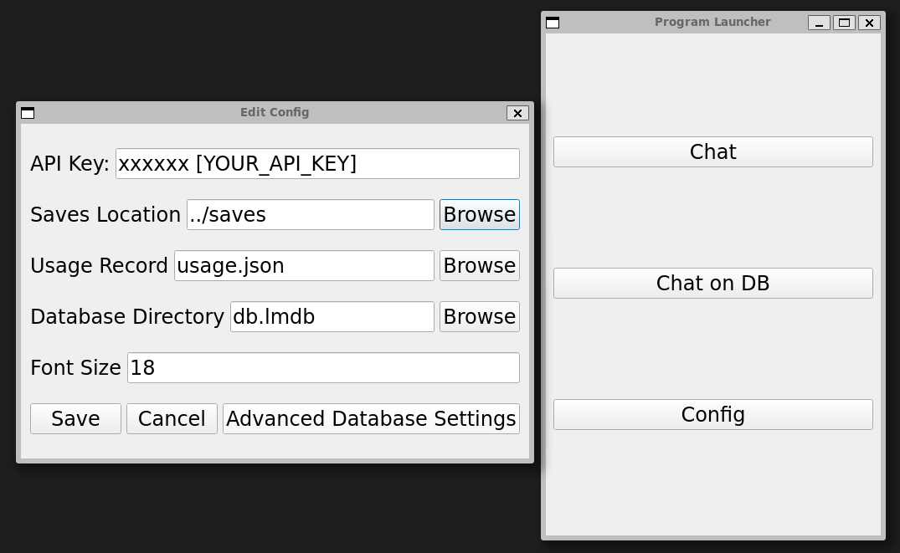

# GPTtoolbox
app with GUI for various models of GPT

## Requirements
```bash
sudo apt-get install qtbase5-dev
pip install -r requirements.txt
```

## API key
1. Get Your [Openai API keys](https://platform.openai.com/account/api-keys)
2. Paste it in config 
    

**Important Action: Ensure the safety of your API keys. Never make them publicly accessible or upload them to a public repository.**

## Usage
```
python src/main.py
```
### Available programs
|Name|Filename|Fucntion|
|--|--|--|
|Chat|src/app/stream_chat.py| Text conversation|
|Chat On DB|src/app/db_chat.py| Text conversation according to background knowledge|

### Chat on DB


Use `Process` to load documents to `LMDB`.

Click filenames in the right list to set it as background knowledge.